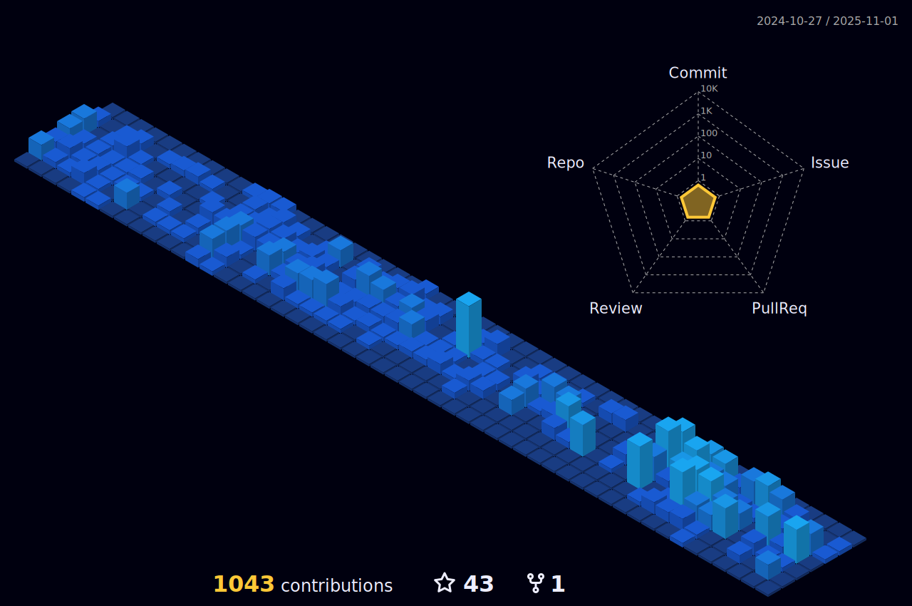

# ~$ Hello World

-   Coding at Carga online;
-   Studying MBA in Software Engineering at USP
-   Contact me by:
		<ul>
			<li>
				Email: guiliuri14@gmail.com;
			</li>
		</ul>
-   Check my online certificates <a href="https://cursos.alura.com.br/user/guiliuri/fullCertificate/d01f46916e7e645ee4f572502de23f5c">here.</a>

 
  	
	 
   	
	

 

##

	 
	
	 

